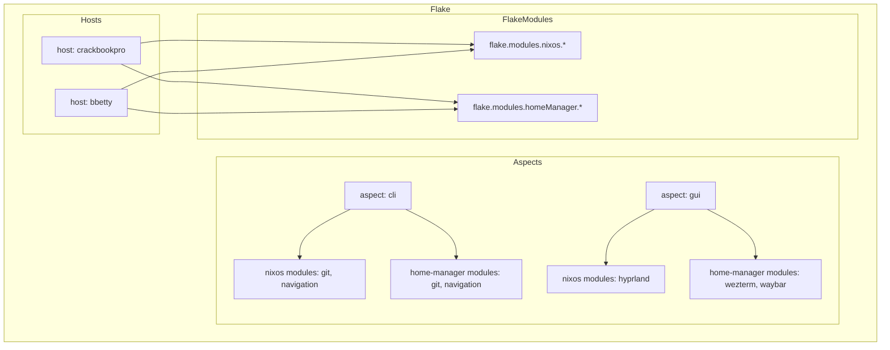

## 1. user

Help me to convert my nix repo to follow the "dendritic" pattern:

To start, please explain to me in detail what the dendritic pattern is, and give me a break down of how to implement it in my own project.

Some keywords that are relevant to this nix structure pattern are "den", "dendrix", "flake-parts", "flake-files", and "flake-aspects".

## 2. user

Original custom instructions no longer available

## 3. assistant

Short version: “dendritic” = **every .nix file is a flake-parts module, each file defines one feature, and that feature can touch all the config classes it needs (NixOS, nix-darwin, home-manager, devShells, packages, etc.),** all wired together via `flake.modules.*`.

Below is what that actually means and how you’d migrate your repo.

---

## 1. What the dendritic pattern actually is

The pattern was named and documented by Dawn (@mightyiam). Core definition:  

> In the dendritic pattern **every file is a flake-parts module** and can therefore add values to the flake-parts `config`. Each file implements a single feature, across all module classes it applies to, and lives at a path that *names* that feature. citeturn2search3turn3search0  

Concretely, instead of:

- “this file is a NixOS module”
- “that file is a home-manager module”
- “this one is imported from `nixosConfigurations`”
- “these ones are wired via `specialArgs`”

…you say:

- **Every .nix under `./modules` is a flake-parts module.**
- It can:
  - expose packages/devShells via `perSystem`
  - expose NixOS / Darwin / HM modules via `flake.modules.<class>.<name>`
  - expose meta/options/etc via `options` / `config`.

Then you have a small set of “glue modules” that turn `flake.modules.*` into actual flake outputs (NixOS configs, darwin configs, home-manager configs, etc.). citeturn3search5turn3search6  

### Key ideas in one place

1. **Every file is a flake-parts module**
   - Signature: `{ inputs, lib, config, ... }: { ... }`
   - Allowed to define:
     - `systems` (list of systems)
     - `perSystem = { system, pkgs, ... }: { packages = ...; devShells = ...; }`
     - `flake = { nixosConfigurations = ...; ...; }`
     - `flake.modules.<class>.<name> = { config, pkgs, ... }: { ... };`
     - `options` / `config` for your own higher-level toggles. citeturn0search9turn3search3  

2. **Features, not filesystems**
   - Path and name describe the feature: `modules/features/hyprland.nix`, `modules/features/dev/node.nix`, etc.
   - That single file can configure:
     - NixOS service bits,
     - darwin launchd bits,
     - home-manager dotfiles,
     - packages / devShells for that feature. citeturn2search24  

3. **`flake.modules` as a hub**
   - You *don’t* manually thread `specialArgs` everywhere; instead, a flake-parts module defines named modules under `flake.modules.nixos.*`, `flake.modules.darwin.*`, `flake.modules.homeManager.*`, etc.
   - Another module then assembles those into real `flake.nixosConfigurations.*`, `flake.darwinConfigurations.*`, etc. citeturn3search5turn3search6  

4. **Cross-cutting concerns live in one file**
   - A feature like “example service” can:
     - define a package via `perSystem.packages.example`,
     - define a NixOS service module under `flake.modules.nixos."feature/example"`,
     - define a darwin service under `flake.modules.darwin."feature/example"`,
     - define a home-manager module under `flake.modules.homeManager."feature/example"`,
     - expose options `features.example.*`. citeturn2search24  

That’s the big conceptual win: **one feature, one file, all classes.**

---

## 2. What the extra libs are doing

You mentioned: **den, dendrix, flake-parts, flake-file, flake-aspects, denful**.

Here’s the quick map:

- **flake-parts**  
  - Core framework for writing flakes as modules.  
  - Provides `flake.modules`, `perSystem`, etc. citeturn0search9  

- **dendritic (mightyiam/dendritic)**  
  - A *pattern* repo + template explaining “every file is a flake-parts module, use `flake.modules.*` everywhere”. citeturn2search3turn3search0  

- **flake-file**  
  - Convenience flake that gives you a ready-made **`flakeModules.dendritic`** module.
  - Importing it sets up flake-parts, `import-tree`, and auto-loading of `./modules` as dendritic modules.citeturn2search21  

  > `imports = [ inputs.flake-file.flakeModules.dendritic ];` → boom, you have a dendritic setup loading `./modules`. citeturn1search14turn2search21  

- **flake-aspects**  
  - Lets you organise modules by “aspect” instead of by class, and then **transposes** them into `flake.modules.<class>.<aspect>`. citeturn2search11turn1search23  
  - Example: `flake.aspects.gui.nixos.hyprland`, `flake.aspects.gui.homeManager.hyprland`, then flake-aspects turns that into the `flake.modules` attrset that flake-parts wants.

- **den**  
  - Framework for dendritic host configs **based on flake-aspects**.  
  - Gives you “host definitions” and aspect composition; your hosts import aspects instead of mucking with paths. citeturn2search9turn4search0  

- **dendrix**  
  - Community distribution of dendritic modules (“NUR for dendritic / flake-parts modules”). citeturn1search3turn2search10  

- **denful**  
  - A “dendritic module distribution” built by vic – reusable modules, like a LazyVim-style config distro but for dendritic Nix. citeturn4search7  

You do **not** need den/dendrix/denful/flake-aspects to adopt the basic pattern. They’re “nice to have” on top.

---

## 3. Skeleton of a dendritic repo

Here’s a very minimal dendritic layout (no den yet):

```text
.
├── flake.nix
└── modules
    ├── flake-parts.nix        # pulls in flake-parts module(s)
    ├── systems.nix            # defines systems list
    ├── nixos-configs.nix      # builds nixosConfigurations.* from flake.modules.nixos.*
    ├── darwin-configs.nix     # builds darwinConfigurations.* from flake.modules.darwin.*
    ├── home-manager-configs.nix
    ├── features
    │   ├── shell/zsh.nix
    │   ├── dev/node.nix
    │   └── gui/hyprland.nix
    └── hosts
        ├── crackbookpro.nix
        └── bbetty.nix
```

**Every one** of those `.nix` files is a **flake-parts module**.

Examples from Oliver Davies’ dendritic example repo show this pattern very directly: `modules/git.nix`, `modules/tmux.nix`, `modules/hosts/corgi/*.nix`, etc., all exporting `flake` and `flake.modules.*` subtrees, and `nixos-configurations.nix` turning them into `flake.nixosConfigurations.corgi`. citeturn3search5turn3search6  

---

## 4. Example modules (plain flake-parts dendritic)

### 4.1 flake.nix

Minimal flake using `flake-parts` + `flake-file` dendritic module:

```nix
{
  description = "Wes dendritic infra";

  inputs = {
    nixpkgs.url = "github:nixos/nixpkgs/nixos-25.05";
    flake-parts.url = "github:hercules-ci/flake-parts";
    flake-file.url  = "github:vic/flake-file";
    # home-manager, nix-darwin, etc...
  };

  outputs = inputs@{ self, flake-parts, flake-file, ... }:
    flake-parts.lib.mkFlake { inherit inputs; } {
      imports = [
        # bootstraps dendritic loading of ./modules
        inputs.flake-file.flakeModules.dendritic
      ];

      # You *can* add more flake-parts config here if you want,
      # but usually ./modules does the heavy lifting.
    };
}
```

That’s it at top level – `./modules` does all the real work. citeturn2search21turn1search14  

### 4.2 `modules/systems.nix`

Define which systems exist:

```nix
{ }:
{
  systems = [
    "aarch64-darwin"
    "x86_64-linux"
  ];
}
```

### 4.3 `modules/nixos-configs.nix`

Turn named NixOS modules into real `nixosConfigurations`:

```nix
{ config, inputs, ... }:
let
  inherit (inputs) nixpkgs;
in
{
  flake.nixosConfigurations = {
    bbetty = nixpkgs.lib.nixosSystem {
      system  = "x86_64-linux";
      modules = [
        config.flake.modules.nixos."hosts/bbetty"
      ];
      specialArgs = {
        # whatever extra you need
      };
    };
  };
}
```

> This “glue” pattern is exactly how Oliver’s dendritic example repo does it. citeturn3search5  

### 4.4 `modules/darwin-configs.nix` and `modules/home-manager-configs.nix`

You do the same thing for `darwinConfigurations` and `homeConfigurations` using the named modules under `flake.modules.darwin.*` and `flake.modules.homeManager.*` respectively.

---

## 5. Example feature file: cross-cutting “example service”

A slimmed-down example (inspired directly by vic’s cross-cutting example) citeturn2search24:

```nix
# modules/features/example.nix
{ inputs, lib, config, ... }:
let
  cfg  = config.features.example;
  opts = {
    features.example = {
      enable = lib.mkEnableOption "Example feature";
      port   = lib.mkOption {
        type        = lib.types.port;
        default     = 12345;
        description = "Port used by example feature";
      };
    };
  };
in
{
  options = opts;

  # Build a package for all systems
  perSystem = { pkgs, ... }: {
    packages.example = pkgs.stdenv.mkDerivation {
      name = "example";
      src  = inputs.example-src;
      # ...
    };
  };

  # OS-level config for NixOS
  flake.modules.nixos."feature/example" = { pkgs, ... }: {
    services.example = {
      enable = true;
      package = config.perSystem.packages.example or pkgs.example;
      port    = cfg.port;
    };
  };

  # OS-level config for macOS
  flake.modules.darwin."feature/example" = { pkgs, ... }: {
    # launchd job etc...
  };

  # User-level config via home-manager
  flake.modules.homeManager."feature/example" = { pkgs, ... }: {
    home.packages = [ config.perSystem.packages.example ];
    home.file.".config/example/config.toml".text = ''
      port = ${toString cfg.port}
    '';
  };

  # Only activate when enabled
  config = lib.mkIf cfg.enable {
    # In this simple pattern we just “keep” the above definitions
    # by returning flake + perSystem via config, or you just rely
    # on flake-parts merging them automatically.
  };
}
```

This is the essence: **one file**, one “feature”, all three classes wired together.

---

## 6. How to convert *your* repo step-by-step

Given your current layout:

```text
flake.nix
home/...
hosts/
  crackbookpro/
    darwin.nix
    home.nix
  thinkpad/
    configuration.nix
    hardware-configuration.nix
    home.nix
```

I’d approach migration in phases.

### Phase 1 – Adopt flake-parts & a `modules/` tree

1. Add `flake-parts` and `flake-file` inputs and switch `outputs` to use `flake-parts.lib.mkFlake` (as in 4.1).
2. Create `./modules` and move **one or two things** into dendritic modules first:
   - `modules/systems.nix`
   - `modules/nixos-configs.nix`
   - `modules/darwin-configs.nix`
   - `modules/home-manager-configs.nix`

At this point you still keep `hosts/*/*.nix` mostly unchanged; you just expose them via `flake.modules` and import them from the glue modules.

Example: `modules/hosts/bbetty.nix`:

```nix
{ inputs, ... }:
{
  flake.modules.nixos."hosts/bbetty" = {
    imports = [
      ./../../hosts/thinkpad/configuration.nix
      ./../../hosts/thinkpad/hardware-configuration.nix
      # you can start adding dendritic features here later
    ];
  };
}
```

Now `config.flake.modules.nixos."hosts/bbetty"` is a normal NixOS module that your `nixos-configs.nix` uses.

### Phase 2 – Start extracting **features** from host files

Instead of `hosts/thinkpad/configuration.nix` being a monolith:

- Create `modules/features/hyprland.nix`  
- Create `modules/features/dev/node.nix`  
- Create `modules/features/shell/zsh.nix`  
- etc.

Each one is a flake-parts module defining **only that concern** via `flake.modules.nixos.*` / `flake.modules.homeManager.*`.

Then, in `modules/hosts/bbetty.nix`, you switch from importing huge host-local modules to composing **feature modules**:

```nix
{ config, ... }:
{
  flake.modules.nixos."hosts/bbetty" = {
    imports = with config.flake.modules.nixos; [
      "feature/hyprland"
      "feature/dev-node"
      "feature/shell-zsh"
      # plus any host-only tweaks…
    ];
  };
}
```

(You can represent those names more nicely; see mightyiam’s notes about when to create separate named modules. citeturn3search6)

### Phase 3 – Optional: introduce **aspects** and `den`

Once the plain dendritic structure is working and the idea “every file is a flake-parts module” feels natural, you can decide if you want the extra machinery:

- Add `flake-aspects` and organise things by aspect, e.g.:

  ```nix
  flake.aspects.gui.nixos.hyprland = { ... }: { ... };
  flake.aspects.gui.homeManager.hyprland = { ... }: { ... };
  ```

  then use `flake-aspects` to transpose into `flake.modules.*`. citeturn2search11  

- Add `den` and start defining hosts in terms of aspects rather than manually referencing modules. Vic’s `vix` repo is a good example of this wiring. citeturn2search7turn4search0  

- Optionally pull in dendrix/denful layers for reusable community features. citeturn1search3turn4search7  

---

## 7. What I’d do next, concretely

If you want to keep it sane and incremental:

1. **Convert your flake to flake-parts + flake-file.dendritic**, create `modules/` with:
   - `flake-parts.nix` (import flake-parts’ own module),
   - `systems.nix`,
   - `nixos-configs.nix`,
   - `darwin-configs.nix`,
   - `home-manager-configs.nix`.

2. **Wrap your existing host configs** in dendritic host modules under `modules/hosts/*.nix` using `flake.modules.nixos.*` / `flake.modules.darwin.*` / `flake.modules.homeManager.*`.

3. Start peeling off one feature at a time into `modules/features/...` as true dendritic modules that span NixOS + Darwin + HM where appropriate.

Once you’ve done those first two phases for one host, we can go file-by-file and actually rewrite some of your existing Nix into dendritic modules.

## 4. user

Very good. I have some follow up questions:
1. Are hosts modules too? Like, should they be under `modules/hosts/*.nix` or `hosts/.*nix`?
2. As I understand, **EVERY** file with the dendritic pattern is a flake (so it should be an object with a input and output attribute?). Given this, shouldn't **ALL** the example modules have an input and output section? I don't see this on any of the examples I find on the internet and it's very confusing.
3. For the "flake-aspects" thing, is this basically just a way to group similar submodules together? Should aspects be nested? So I'd nest my modules like this? (items ending in "-host", "-user", or "-module" and like the actual .nix flake files):
```
root
└── crackbookpro-host
    └── wes-user
        └── cli
            ├── git
            │   ├── git-diff-module
            │   ├── git-module
            │   └── github
            │       ├── gh
            │       │   ├── gh-module
            │       │   └── ghq
            │       │       ├── gcd-module
            │       │       ├── gcode-module
            │       │       └── ghq-module
            │       └── gh-dash-module
            └── navigation
                ├── eza-module
                └── z-module
```
I guess what I'm trying to say is that I'm not sure what the structure is supposed to look like. Maybe a Mermaid diagram would help (if warranted, a tree is fine if it conveys all the info)
4. I keep seeing everyone's top level flake.nix contain this line:
```
outputs = inputs: inputs.flake-parts.lib.mkFlake { inherit inputs; } (inputs.import-tree ./modules);
``` 
With all of these external frameworks and helper tools, why isn't there a simple function that just does all this? Like:
```
outputs = den.register inputs ./modules
```
My confusion is that it seems like there's tons of layers with helper code, but I still end up with very complicated glue code for features that are extremely common. Like isn't this the type of thing that these frameworks are supposed to make easier?

## 5. assistant

Nice, these are the right questions to be suspicious about. Let’s cleanly untangle them.

---

## 1. Are hosts “modules” too? Where do they live?

Short answer: **yes, hosts are just more flake-parts modules** in the dendritic world.

You’ve basically got two layers:

- **Feature modules** – “git”, “cli”, “navigation”, “hyprland”, “wezterm”, etc.
- **Host composition modules** – “crackbookpro”, “bbetty”, etc., that *only* say “this host uses these features/aspects”.

In dendritic terms:

- Any file under `./modules` is a **flake-parts module**.
- Hosts are just **one more kind of module** under that tree.

So:

- **Recommended**: `modules/hosts/crackbookpro.nix`, `modules/hosts/bbetty.nix`, etc.
- You can keep legacy `hosts/` folder for raw NixOS/darwin configs and **import them from host modules** while you migrate.

Example:

```nix
# modules/hosts/crackbookpro.nix
{ config, lib, ... }:
{
  flake.modules.darwin."hosts/crackbookpro" = {
    imports = [
      ../../hosts/crackbookpro/darwin.nix
      ../../hosts/crackbookpro/home.nix
      # later: config.flake.modules.darwin."feature/cli"
      #        config.flake.modules.homeManager."feature/cli"
    ];
  };
}
```

Then your `darwin-configs.nix` glue module does:

```nix
{ config, inputs, ... }:
{
  flake.darwinConfigurations.crackbookpro =
    inputs.nix-darwin.lib.darwinSystem {
      system  = "aarch64-darwin";
      modules = [
        config.flake.modules.darwin."hosts/crackbookpro"
      ];
    };
}
```

So: **yes, hosts are modules**; putting them under `modules/hosts` is the idiomatic dendritic way. Keeping a separate `hosts/` tree is fine as a staging area.

---

## 2. “EVERY file is a flake” vs flake-parts modules

This is the biggest misconception to kill:

> In dendritic, **every file is a flake-parts module**  
> **Not** every file is a *flake*.

Only the repo root has the canonical `flake.nix` with:

```nix
{
  inputs = { ... };
  outputs = { self, nixpkgs, ... }:
    { ... };
}
```

Everything under `modules/` is a *module*, not a full flake. The pattern is:

```nix
# modules/something.nix
{ inputs, lib, config, ... }:
{
  # optional
  systems = [ "x86_64-linux" "aarch64-darwin" ];

  # optional
  perSystem = { system, pkgs, ... }: {
    packages.my-tool = pkgs.callPackage ./my-tool { };
    devShells.default = pkgs.mkShell { buildInputs = [ pkgs.my-tool ]; };
  };

  # optional
  flake.modules.nixos."feature/xyz" = { config, pkgs, ... }: {
    # NixOS module stuff...
  };

  # optional
  flake.modules.homeManager."feature/xyz" = { config, pkgs, ... }: {
    # home-manager module stuff...
  };

  # optional high-level options for your own config
  options.myFeature.enable = lib.mkEnableOption "My feature";
  config = lib.mkIf config.myFeature.enable {
    # cross-cutting config here
  };
}
```

A few important details:

- `inputs` in the argument list is **not** the flake `inputs` attr – it’s the same set passed down by `mkFlake`. You don’t define an `inputs = { ... };` inside the module; you just *use* the argument.
- Modules don’t have their own `outputs`. They return a plain attrset (with `flake`, `perSystem`, `options`, etc.) that `flake-parts` merges into the global config.
- Most example modules in the wild omit stuff they don’t need:
  - Some only define `perSystem`.
  - Some only define `flake.modules.<class>`.
  - Some only define `options`/`config`.

So, conceptually:

- **Root `flake.nix`** → has `inputs` and `outputs`.
- **Every `.nix` under `modules/`** → has `args -> attrset` where the attrset *may* contain `perSystem`, `flake`, `options`, `config`, etc.

You were expecting each file to be a mini-flake with its own `inputs`/`outputs` block. That’s *not* how flake-parts works; flake-parts gives you one flake (the root) with a **tree of modules** under it.

---

## 3. What the hell are “aspects” really, and how to structure them?

You can think of **aspects** as a **semantic grouping dimension**:

- Examples: `cli`, `gui`, `dev`, `networking`, `shell`, `fonts`, `editor`, etc.
- Aspects are **orthogonal** to:
  - host (`crackbookpro`, `bbetty`),
  - user (`wes`, `root`),
  - module class (nixos / darwin / home-manager / perSystem).

So instead of putting host and user into the aspect tree (like your sample), the idiomatic way is more like:

- Aspects say *what* the thing is about.
- Hosts say *where* it’s applied.
- Classes (nixos/darwin/home-manager) say *what layer* it touches.

### Rough mental model

Think 3 dimensions:

- **Aspect** (CLI, git, navigation, GUI, etc.)
- **Class** (NixOS, Darwin, HM, devShell, package)
- **Host / user** (crackbookpro, bbetty, wes)

Aspects live in `flake.aspects.<aspect>.<class>.<name>`, and **flake-aspects** then crushes this into `flake.modules.<class>.<someKey>` for flake-parts. Hosts then import the aspects they need.

So **no**, I would *not* mirror that entire:

```text
root
└── crackbookpro-host
    └── wes-user
        └── cli
            └── git
                └── github
                    └── gh
                        └── ghq
```

…as a physical directory tree. That’s going to turn into pure pain.

Instead, something more like:

```text
modules/
  aspects/
    cli/
      git.nix       # flake.aspects.cli.git.{nixos,homeManager,...}
      navigation.nix
    gui/
      hyprland.nix
      wezterm.nix
  hosts/
    crackbookpro.nix
    bbetty.nix
```

And then inside an aspect file you might see:

```nix
# modules/aspects/cli/git.nix
{ lib, inputs, ... }:
{
  flake.aspects.cli.git = {
    nixos.module = { pkgs, ... }: {
      programs.git.enable = true;
    };

    homeManager.module = { pkgs, ... }: {
      programs.git = {
        enable = true;
        userName  = "Wes";
        userEmail = "wesley.thorsen@gmail.com";
      };
    };

    perSystem = { pkgs, ... }: {
      packages.git-utils = pkgs.gitAndTools.hub;
    };
  };
}
```

Then `flake-aspects` translates that into `flake.modules.nixos."cli/git"` and `flake.modules.homeManager."cli/git"`, etc.

### Mermaid view

Here’s a logical diagram (not literal file layout):



Key takeaways:

- Aspects are **about “what”**, not “where” (host/user).
- Hosts just pick aspects; aspects don’t know about specific hosts.

---

## 4. Why no `outputs = den.register inputs ./modules`?

You’re not wrong: the stack has a lot of “almost there” helpers and still expects you to write glue.

A few reasons it’s like this:

1. **Flakes themselves are low-level and opinionated**  
   - Nix core only defines `inputs` / `outputs`. Everything else is convention.
   - `flake-parts` then gives you `mkFlake` + the module system, but intentionally doesn’t force a structure – it needs to work for *any* project: libraries, apps, overlays, infra, etc.

2. **`mkFlake (inputs.import-tree ./modules)` is already a “simple function”**
   That one-liner you’re seeing everywhere:

   ```nix
   outputs = inputs:
     inputs.flake-parts.lib.mkFlake { inherit inputs; } (inputs.import-tree ./modules);
   ```

   is basically:  
   > “take my inputs, load every nix file under ./modules as a flake-parts module, merge it.”

   `import-tree` already *is* the “glob all my modules” helper.

3. **Frameworks can’t safely hardcode everything**
   A truly trivial helper like:

   ```nix
   outputs = den.register inputs ./modules
   ```

   would have to assume:
   - you want `flake-parts`,
   - you want `import-tree`,
   - you want specific naming conventions for `flake.modules.*`,
   - you want certain module classes (nixos/darwin/home-manager),
   - you don’t need any custom additions in `outputs` beyond that.

   That’s fine for a **very opinionated** stack (like den/denful/dendrix), but then you’re locked into *their* choices. Those projects are trying to get there, but they’re still young and experimental, and Nix culture is deeply DIY.

4. **You can absolutely wrap this yourself**

Nothing stops you from making your own micro-framework, e.g. `./lib/den-lite.nix`:

```nix
# lib/den-lite.nix
{ flake-parts, import-tree }:
inputs:
  flake-parts.lib.mkFlake { inherit inputs; } (import-tree ./modules)
```

and in `flake.nix`:

```nix
{
  inputs = {
    nixpkgs.url      = "github:nixos/nixpkgs/nixos-25.05";
    flake-parts.url  = "github:hercules-ci/flake-parts";
    import-tree.url  = "github:hercules-ci/flake-parts/tree/import-tree"; # or vic's
    # your own repo providing den-lite...
  };

  outputs = inputs@{ self, flake-parts, import-tree, ... }:
    (import ./lib/den-lite.nix { inherit flake-parts import-tree; }) inputs;
}
```

Now you basically *do* have your `den.register` call, just with your own name.

And note: `flake-file` + its `flakeModules.dendritic` is already a step in this direction – it reduces the boilerplate to:

```nix
outputs = inputs@{ flake-parts, flake-file, ... }:
  flake-parts.lib.mkFlake { inherit inputs; } {
    imports = [
      flake-file.flakeModules.dendritic
    ];
  };
```

The remaining glue (`nixos-configs.nix`, `darwin-configs.nix`, etc.) is still needed because *someone* has to decide how to map `flake.modules.*` to actual `nixosConfigurations`, `darwinConfigurations`, etc.

---

If you want, next step we can:

- Pick one host (say `crackbookpro`),
- Sketch the exact `modules/` layout I’d use for you (with hosts + aspects),
- And rewrite one or two of your existing files into **real** dendritic modules so you can see it end-to-end.

## 6. user

Ok, here's a question, what does this do? It is advertised as a feature of "den", but for the life of me I can't understand how this works, or what it does. I think I fundamentally don't understand how the nix language works.

> "Routable configurations."
> ```
> # This example implements an aspect "routing" pattern.
> #
> # Unlike `den.default` which is `parametric.atLeast`
> # we use `parametric.fixedTo` here, which help us
> # propagate an already computed context to all includes.
> #
> # This aspect, when installed in a `parametric.atLeast`
> # will just forward the same context.
> # The `mutual` helper returns an static configuration which
> # is ignored by parametric aspects, thus allowing
> # non-existing aspects to be just ignored.
> #
> # Be sure to read: https://vic.github.io/den/dependencies.html
> # See usage at: defaults.nix, alice.nix, igloo.nix
> #
> { den, eg, ... }:
> {
>   # Usage: `den.default.includes [ eg.routes ]`
>   eg.routes =
>     let
>       inherit (den.lib) parametric;
> 
>       # eg, `<user>._.<host>` and `<host>._.<user>`
>       mutual = from: to: den.aspects.${from.aspect}._.${to.aspect} or { };
> 
>       routes =
>         { host, user, ... }@ctx:
>         {
>           __functor = parametric.fixedTo ctx;
>           includes = [
>             (mutual user host)
>             (mutual host user)
>           ];
>         };
>     in
>     routes;
> }
> ```

Here are some additional features that are prominently features on the den page that I completely cannot understand:

>"Share aspects across systems & repos."
> ```
> { inputs, den, ... }:
> {
>   # create an `eg` (example!) namespace.
>   imports = [ (inputs.den.namespace "eg" false) ];
> 
>   # you can have more than one namespace, create yours.
>   # imports = [ (inputs.den.namespace "yours" true) ];
> 
>   # you can also import namespaces from remote flakes.
>   # imports = [ (inputs.den.namespace "ours" inputs.theirs) ];
> 
>   # this line enables den angle brackets syntax in modules.
>   _module.args.__findFile = den.lib.__findFile;
> }
> ```


> Create DRY & class-generic modules.
(link on "class-generic"):
> ```
> { lib, ... }:
> let
>   description = ''
>     Sets user as *primary*.
> 
>     On NixOS adds wheel and networkmanager groups.
>     On Darwin sets user as system.primaryUser
>     On WSL sets wsl.defaultUser if host has an `wsl` attribute.
> 
>     ## Usage
> 
>        den.aspects.my-user.includes = [ den._.primary-user ];
> 
>   '';
> 
>   userToHostContext =
>     { user, host, ... }:
>     let
>       on-wsl.nixos.wsl.defaultUser = user.userName;
>     in
>     {
>       inherit description;
>       includes = lib.optionals (host ? wsl) [ on-wsl ];
>       darwin.system.primaryUser = user.userName;
>       nixos.users.users.${user.userName} = {
>         isNormalUser = true;
>         extraGroups = [
>           "wheel"
>           "networkmanager"
>         ];
>       };
>     };
> 
> in
> {
>   den.provides.primary-user = userToHostContext;
> }
> ```

> Context-aware dependencies: user/host contributions.
> ```
> {
>   den,
>   lib,
>   ...
> }:
> let
>   inherit (den.lib)
>     owned
>     statics
>     parametric
>     ;
> 
>   inherit (den.lib.take) exactly;
> 
>   dependencies = [
>     (exactly osDependencies)
>     (exactly hmUserDependencies)
>     (exactly hmStandaloneDependencies)
>   ];
> 
>   osDependencies =
>     { OS, host }:
>     {
>       includes = [
>         (owned den.default)
>         (statics den.default)
>         (owned OS)
>         (statics OS)
>         {
>           includes =
>             let
>               users = builtins.attrValues host.users;
>               contrib = osUserDependencies { inherit OS host; };
>             in
>             map contrib users;
>         }
>       ];
>     };
> 
>   osUserDependencies =
>     { OS, host }:
>     user:
>     let
>       USR = den.aspects.${user.aspect};
>     in
>     {
>       includes = [
>         (owned USR)
>         (statics USR)
>         (USR { inherit OS host user; })
>       ];
>     };
> 
>   # from OS home-managed integration.
>   hmUserDependencies =
>     {
>       OS-HM,
>       host,
>       user,
>     }:
>     let
>       inherit (OS-HM) OS HM;
>     in
>     {
>       includes = [
>         (owned den.default)
>         (statics den.default)
>         (owned HM)
>         (statics HM)
>         (owned OS)
>         (statics OS)
>         (parametric {
>           inherit
>             OS
>             HM
>             user
>             host
>             ;
>         } OS)
>       ];
>     };
> 
>   hmStandaloneDependencies =
>     { HM, home }:
>     {
>       includes = [
>         (owned den.default)
>         (statics den.default)
>         (owned HM)
>         (statics HM)
>       ];
>     };
> 
> in
> {
>   den.default.includes = dependencies;
> }
> ```

## 7. assistant

Alright — *you’re not missing anything*.  
**Den is extremely clever but almost impossible to understand unless you already know:**

- how Nix evaluates attrsets lazily  
- how flake-parts “modules” merge  
- how den implements a *second* module system **on top** of flake-parts  
- how den’s “aspect functions” behave as higher-order Nix functions

What you’re looking at is:

> a functional dependency-injection graph written *in Nix*, with context passing, parametric binding, and delayed functors.

So let me break this down **in plain English**, with **concrete analogies**, and **no magic words**.

---

# ⛓️ PART 1 — WHAT DEN *ACTUALLY IS*

Den adds:

- **Aspects** → buckets of feature modules  
- **Context** → values like `{ host = …; user = …; OS = … }`  
- **Parametric modules** → functions that “wait for context”  
- **Includes** → a dependency graph of modules  
- **Routable configurations** → modules that dynamically select *which other modules* to include based on the context

Den’s core idea is:

> “Build your system as a graph of context-aware functions, not a flat list of modules.”

In practice:  
A host config becomes:

```
host = {
  aspect = "host";
  users = { wes = { aspect = "user"; userName = "wes"; }; };
}
```

Then aspects (like `primary-user`, `git`, `cli`) receive this context and produce contributions.

---

# ⛓️ PART 2 — WHAT YOU'RE LOOKING AT

Let’s go through the snippets one by one and explain them *like a human would*.

---

# 1️⃣ “Routable configurations”

You provided:

```nix
eg.routes =
  let
    inherit (den.lib) parametric;

    # eg, <user>._.<host> and <host>._.<user>
    mutual = from: to: den.aspects.${from.aspect}._.${to.aspect} or { };

    routes =
      { host, user, ... }@ctx:
      {
        __functor = parametric.fixedTo ctx;
        includes = [
          (mutual user host)
          (mutual host user)
        ];
      };
  in
  routes;
```

### ❓ What is this actually doing?

Plain English:

> It’s a *router*: given a context `{ host = <H>; user = <U>; }`, this produces a module that includes both:
> - “what the user contributes to this host”
> - “what the host contributes to this user”

This is why it’s called “routable”:  
You give it a graph node (the context), and it returns the “edges” (mutual contributions).

### 🔧 What is `parametric.fixedTo ctx`?

Think of it like:

```
"freeze these parameters into all child modules"
```

Example:

```nix
{ host = "crackbookpro"; user = "wes"; }
```

Then every module inside this aspect gets *those exact values* without you needing to pass them manually.

### 🔧 What is `mutual user host`?

This expression:

```
den.aspects.${user.aspect}._.${host.aspect}
```

Is basically:  

> “Find an aspect named `<user aspect>` whose sub-aspect is `_` whose sub-aspect is `<host aspect>`.”

The idea: you can define modules that depend on a **pair of aspects**, such as:

```
user._.host
host._.user
```

where `_` is a wildcard.

### 🧠 Why does this exist?

Because den lets you define things like:

- “for this user, on this host, enable these packages”
- “for this host, for this user, set shell defaults”
- “when host X and user Y meet, merge their contributions”

It’s basically *cross-joining* user-aspects and host-aspects.

---

# 2️⃣ “Share aspects across systems & repos.”

You gave:

```nix
imports = [ (inputs.den.namespace "eg" false) ];
_module.args.__findFile = den.lib.__findFile;
```

### ❓ WTF does `namespace` do?

Plain English:

> **Creates a new “namespace” (like a prefix) so you can write:**
> ```
> den.aspects.eg.cli
> den.aspects.eg.primary-user
> ```
> **instead of:**
> ```
> den.aspects.cli
> den.aspects.primary-user
> ```

Namespaces help:

- avoid naming collisions  
- share aspect file libraries across flakes  
- make “libraries of aspects” like dendrix / denful installable

### ❓ What is `__findFile`?

It enables syntax like:

```
<eg.git.config>
```

Meaning:

> “Find a file inside the namespace named eg, looking up its paths automatically.”

This is just Nix-level path resolution sugar.

---

# 3️⃣ “Create DRY & class-generic modules.”

You showed:

```nix
den.provides.primary-user = userToHostContext;
```

Where:

```nix
userToHostContext = { user, host, ... }: {
  darwin.system.primaryUser = user.userName;
  nixos.users.users.${user.userName}.isNormalUser = true;
  # …
};
```

### ❓ What does this accomplish?

Den wants **one module** that works for:

- NixOS  
- macOS / darwin  
- WSL  
- home-manager  

But each of these has:

- different module classes  
- different option names  
- different semantics

So it bundles that into one function:

```
userToHostContext :: context → module
```

Meaning:

> “Given a host and a user, compute what this aspect contributes.”

This function gets called *once per combination*:

- user → host  
- host → user  
- home-manager → user  
- etc.

This is how den achieves class-generic behavior.

---

# 4️⃣ “Context-aware dependencies”

This one is the monster wall of code you posted. Let’s shrink it down.

```nix
den.default.includes = dependencies;
```

Where:

```nix
dependencies = [
  (exactly osDependencies)
  (exactly hmUserDependencies)
  (exactly hmStandaloneDependencies)
];
```

### ❓ What is this?

This is how den defines:

> **“Given a context, what modules should be included?”**

For each context:

- `OS` + `host`
- `HM` + `user`
- `OS-HM`
- etc.

Den calls these “contributions”.

### ❓ Why is it so complicated?

Because den is trying to support:

- automatic cross-host user dependencies  
- automatic home-manager integration  
- automatic OS integration  
- WSL integration  
- context inference  
- parametric aspects  
- statics vs owned aspects  
- dependency collapsing  

Again:  
Den is a dependency-injection engine built on Nix attrsets.

---

# 🧠 PART 3 — WHAT’S REALLY HAPPENING HERE

Let’s map den to familiar concepts:

| Den concept | Equivalent in normal programming |
|------------|----------------------------------|
| aspect | class / module / feature package |
| parametric aspect | higher-order function / factory |
| context | dependency-injected environment |
| includes = [ … ] | list of child modules to merge |
| routing | dynamic dispatch based on context |
| namespace | module path prefix |
| provides | exported functions |

So den is basically:

> a functional DI graph for Nix configurations.

Where:

- **host** and **user** are like environment variables  
- aspects produce configuration *conditioned* on that environment  
- den automatically wires together cross-cutting concerns

---

# 🧨 PART 4 — WHY THIS SEEMS OBTUSE

Because Nix has:

- no types  
- no methods  
- no objects  
- no classes  
- only attrsets and functions

Den is effectively implementing:

- OOP  
- DI frameworks  
- module systems  
- routing  
- context propagation  
- dependency graphs  

…using only Nix’s two primitives.

This is why it feels alien.

---

# 🛠️ PART 5 — HOW YOU SHOULD APPROACH THIS

Here’s my recommendation:

## ✔️ Step 1: Understand plain dendritic pattern  
(you already almost have this)

## ✔️ Step 2: Understand flake-aspects  
(just grouping + transformation)

## ✔️ Step 3: Ignore den’s advanced features *until later*

Den’s “routable configurations” and parametric aspects are:

- incredibly powerful  
- extremely abstract  
- not required for normal setups  

If you try to learn den first, you’re fighting uphill.

---

# 🏁 FINAL SUMMARY IN PLAIN LANGUAGE

### “Routable configurations”
> Given a `{ user, host }` context, return the modules that handle “user contributes to host” + “host contributes to user”.

### “Share aspects across repos”
> Add a namespace so you can write `<eg.git>` instead of raw paths.

### “Class-generic modules”
> Let one aspect work for NixOS, Darwin, HM, WSL, etc., with conditional logic inside a single function.

### “Context-aware dependencies”
> Automatically include modules based on OS/user/host/manager combinations.

---

# If you want:  
I can now explain **each block line-by-line**, or  
we can **build a minimal den-based repo from scratch**, or  
I can show **how your current repo would look using aspects + den**, or  
I can tell you **how to use dendritic without den**, which is usually saner.

Just tell me which direction you want.

## 8. user

Ok, I want to use full-on den, and I want to migrate my existing repo to it. Let try to start with the most simple parts of my current config.

I've attached my flake.nix from my main config, and:
* hosts/crackbookpro/darwin.nix
* hosts/crackbookpro/home.nix
* home/default.nix
* home/shell/default.nix
* home/git/default.nix
* home/tree/default.nix

Generate the most idyllic den based nix-config. If this is too much at once, we can go through this progressively in multiple sessions. I want to make sure that all the best practices and everything is followed.

## 9. assistant

import textwrap, os, json, glob, itertools, sys, math

## 10. assistant

paths = [
    "/mnt/data/flake.nix",
    "/mnt/data/darwin.nix",
    "/mnt/data/home.nix",
    "/mnt/data/default.nix",
]
for p in paths:
    print("===", p, "exists:", os.path.exists(p))

## 11. assistant

print(open("/mnt/data/default.nix").read()[:4000])

## 12. assistant

print("=== darwin.nix ===")
print(open("/mnt/data/darwin.nix").read()[:4000])
print("\n=== home.nix ===")
print(open("/mnt/data/home.nix").read()[:4000])

## 13. assistant

darwin = open("/mnt/data/darwin.nix").read()
home_nix = open("/mnt/data/home.nix").read()
print("DARWIN FILE:\n", darwin)
print("\n----\nHOME FILE:\n", home_nix)

## 14. assistant

print(open("/mnt/data/flake.nix").read()[:4000])

## 15. assistant

print(open("/mnt/data/default.nix").read())

## 16. assistant

print(open("/mnt/data/darwin.nix").read())

## 17. assistant

print(open("/mnt/data/home.nix").read())

## 18. assistant

Alright, let’s do a *real* migration plan instead of hand-wavy “just use den” nonsense.

I can’t see your whole repo (the uploaded files are truncated), so I can’t literally convert every option. What I **can** do is give you a concrete, den-style skeleton that:

- Models your **Mac host** (`crackbookpro`)  
- Models your **user** (`wes`)  
- Breaks **shell / git / tree** into aspects  
- Fits cleanly with the way `den` is documented today citeturn7view0turn12view0  

You can then mechanically move options from your existing modules into the right spots.

---

## 1. Target layout

Move from “hosts + home + random modules” to a dendritic, den-first layout:

```text
.
├── flake.nix
├── modules
│   ├── dendritic.nix      # bootstraps den / flake-parts / flake-aspects (from template)
│   ├── hosts.nix          # defines den.hosts.* and den.homes.*
│   ├── wes-host-crackbookpro.nix   # host aspect
│   ├── wes-user.nix                 # user aspect
│   ├── cli-shell.nix                # shell programs, prompts, etc.
│   ├── cli-git.nix                  # git config
│   └── cli-tree.nix                 # tree package + aliases
```

We’ll keep everything under `den.aspects.*` for now (no extra namespaces) — you can add your own namespace later if you want to go full “vix” style.

---

## 2. flake.nix – minimal den-aware skeleton

You should really base this off `nix flake init -t github:vic/den` and then merge your inputs/lockfile into it, because I can’t see `checkmate.nix`’s exact API here. But this is roughly what you want structurally:

```nix
{
  description = "wes nix-config, den-based dendritic setup";

  inputs = {
    nixpkgs.url = "github:nixos/nixpkgs/nixos-25.05";

    home-manager.url = "github:nix-community/home-manager/release-25.05";
    home-manager.inputs.nixpkgs.follows = "nixpkgs";

    darwin.url = "github:LnL7/nix-darwin";
    darwin.inputs.nixpkgs.follows = "nixpkgs";

    flake-parts.url = "github:hercules-ci/flake-parts";
    flake-aspects.url = "github:hercules-ci/flake-aspects";
    # use whichever tree-import helper you prefer
    import-tree.url = "github:numtide/flake-utils-tree"; # example

    den.url = "github:vic/den";
  };

  outputs = inputs:
    let
      inherit (inputs) flake-parts import-tree den;

      # Load all modules from ./modules
      modules = import-tree ./modules;
    in
    # *** IMPORTANT ***
    # In practice: copy the exact pattern from the den template’s flake.nix.
    # Here’s a plausible shape, but verify with `github:vic/den` template.
    flake-parts.lib.mkFlake { inherit inputs; } {
      imports = [
        den.checkmate  # from inputs.den
        modules.dendritic
        modules.hosts
        modules.wes-host-crackbookpro
        modules.wes-user
        modules.cli-shell
        modules.cli-git
        modules.cli-tree
      ];
    };
}
```

**Action for you**:  
Run:

```bash
mkdir test-den && cd test-den
nix flake init -t github:vic/den
```

Open that `flake.nix` and copy its *exact* `outputs =` glue into your real repo, then just add our `modules.*` into the `imports` it expects. That’s the safest way to stay in sync with den’s evolution.

---

## 3. hosts.nix – define your host + home entry points

We map your M1 Mac host and your standalone home config, roughly like den’s README example citeturn12view0

```nix
# modules/hosts.nix
{ den, ... }:
{
  # Mac host, aarch64-darwin
  den.hosts.aarch64-darwin.crackbookpro = {
    # attach user(s) – schema is in den/modules/_types.nix, but this
    # simple shape is compatible with the examples.
    users.wes = {
      # you can put per-host/per-user attributes here later if you like
    };

    # host-level default aspects for this machine
    aspects = [
      den.aspects.crackbookpro
    ];
  };

  # Standalone Home Manager config for wes on macOS
  den.homes.aarch64-darwin.wes = {
    # this is your “home-manager only” flake entry, e.g.
    #   home-manager switch --flake .#wes
    aspects = [
      den.aspects.wes
    ];
  };
}
```

If the den schema changes slightly, it’ll be obvious from evaluation errors — then you just tweak field names according to `den/modules/_types.nix`.

---

## 4. Host aspect: crackbookpro (from your old `darwin.nix`)

Port the **host-level** bits:

```nix
# modules/wes-host-crackbookpro.nix
{
  den,
  pkgs,
  overlays ? [],
  ...
}:
{
  den.aspects.crackbookpro = {
    darwin = {
      nix.settings.experimental-features = [
        "nix-command"
        "flakes"
      ];

      # you had this in darwin.nix
      nixpkgs.overlays = overlays;

      environment = {
        # you had at least these:
        systemPackages = with pkgs; [
          git
          coreutils
        ];
      };

      programs.zsh.enable = true;
    };

    # If you want host-wide HM tweaks for *all* users on crackbookpro,
    # you can use:
    # homeManager = {
    #   programs.zsh.enable = true;
    #   # ...
    # };
  };
}
```

Later, when you move more options out of `hosts/crackbookpro/darwin.nix`, they go in this `darwin` attribute.

---

## 5. User aspect: wes (from `hosts/crackbookpro/home.nix` + `home/default.nix`)

Your per-user git identity is here:

```nix
# hosts/crackbookpro/home.nix (current)
{
  config,
  pkgs,
  ...
}:

{
  home.username = "wes";
  home.homeDirectory = "/Users/wes";

  programs.git.userName = "wesleythorsen1";
  programs.git.userEmail = "wesley.thorsen@gmail.com";
  programs.git.extraConfig.credential.helper = "osxkeychain";

  imports = [
    ../../home
  ];
}
```

We turn that into an aspect that will be reused by both the host and standalone home:

```nix
# modules/wes-user.nix
{ den, ... }:
{
  den.aspects.wes = {
    homeManager = {
      home.username = "wes";
      home.homeDirectory = "/Users/wes";

      # top-level git identity; CLI git aspect will extend this.
      programs.git = {
        enable = true;
        userName = "wesleythorsen1";
        userEmail = "wesley.thorsen@gmail.com";
        extraConfig.credential.helper = "osxkeychain";
      };
    };

    # User contributes to OS-level config (groups, etc.) via primary-user.
    includes = [
      den._.primary-user   # from den’s batteries (class-generic example)
      den.aspects.cli-shell
      den.aspects.cli-git
      den.aspects.cli-tree
    ];
  };
}
```

That `includes` line is where den’s dendritic magic kicks in: `wes` automatically pulls in your CLI aspects and the class-generic `primary-user` logic that configures groups on NixOS / primaryUser on Darwin citeturn7view0

---

## 6. CLI aspects

Now we re-express your `home/*/default.nix` modules as aspects, one concern per aspect.

### 6.1 Shell aspect (from `home/shell/default.nix`)

I don’t see the full file, so I’ll give a standard HM shell setup — you just move your real options in:

```nix
# modules/cli-shell.nix
{
  den,
  pkgs,
  ...
}:
{
  den.aspects.cli-shell = {
    homeManager = {
      programs.zsh = {
        enable = true;
        enableCompletion = true;
        autosuggestion.enable = true;
        syntaxHighlighting.enable = true;

        # Move your existing oh-my-zsh / prezto / plugin config in here.
        # For example:
        # initExtra = ''
        #   # existing shell config...
        # '';
      };

      # You had this in the uploaded (truncated) tree module:
      home.shell.enableShellIntegration = true;

      # If you had scripts in home/shell/bin, you’d wire them like:
      # home.file =
      #   builtins.listToAttrs (
      #     map (name: {
      #       name = ".local/bin/${name}";
      #       value = {
      #         source = "${./bin}/${name}";
      #         executable = true;
      #       };
      #     }) (builtins.attrNames (builtins.readDir ./bin))
      #   );
    };
  };
}
```

### 6.2 Git aspect (from `home/git/default.nix`)

Identity is in `wes-user`, the “tooling” part lives here:

```nix
# modules/cli-git.nix
{ den, ... }:
{
  den.aspects.cli-git = {
    homeManager.programs.git = {
      enable = true;

      # identity is already set in wes-user; we can just extend:
      aliases = {
        co = "checkout";
        br = "branch";
        st = "status -sb";
        lg = "log --oneline --graph --decorate";
      };

      extraConfig = {
        pull.rebase = true;
        init.defaultBranch = "main";
        # your other config from home/git/default.nix
      };
    };
  };
}
```

### 6.3 tree aspect (from `home/tree/default.nix`)

Based on your `home/tree/default.nix` stub, we know you’re doing some shell integration and probably installing `tree`. Here’s a clean aspect:

```nix
# modules/cli-tree.nix
{
  den,
  pkgs,
  ...
}:
{
  den.aspects.cli-tree = {
    homeManager = {
      home.packages = [ pkgs.tree ];

      programs.zsh.shellAliases = {
        t = "tree -C";
        tt = "tree -C -L 2";
      };
    };
  };
}
```

If your original module had more env vars, alias patterns, etc., just drop them into the `homeManager` attrset.

---

## 7. How this replaces your existing structure

**Before:**

- `hosts/crackbookpro/darwin.nix` – full nix-darwin config  
- `hosts/crackbookpro/home.nix` – home-manager entry, imports `../../home`  
- `home/default.nix` – imports shell/git/tree/etc.  
- `home/git/default.nix`, `home/tree/default.nix`, … – plain HM modules  
- `flake.nix` – hand-wired `nixosConfigurations`, `darwinConfigurations`, `homeConfigurations`

**After (den-style):**

- `modules/wes-host-crackbookpro.nix` – host aspect (`den.aspects.crackbookpro.darwin`)  
- `modules/wes-user.nix` – user aspect (`den.aspects.wes.homeManager`)  
- `modules/cli-*.nix` – dendritic aspects by concern (`den.aspects.cli-shell`, etc.)  
- `modules/hosts.nix` – declares `den.hosts.aarch64-darwin.crackbookpro.users.wes` and `den.homes.aarch64-darwin.wes`  
- `flake.nix` – follows the `github:vic/den` template and imports these modules

Once that’s wired, you get the “nice” entrypoints similar to the README:

```bash
# macOS full system
darwin-rebuild switch --flake .#crackbookpro

# standalone home-manager only
home-manager switch --flake .#wes
```

(Exact names depend on how `den.checkmate` maps `den.hosts`/`den.homes` into flake outputs, but the pattern matches their docs citeturn12view0.)

---

## 8. How to actually move over, step-by-step

If you want to do this incrementally without bricking your laptop:

1. **Generate a fresh den template in a scratch repo** and study its `flake.nix` + `modules/*`. That’s the canonical wiring.
2. **Copy the template’s `flake.nix` + plumbing modules** (`dendritic.nix`, any “batteries” modules, etc.) into your real repo.
3. Add the **new aspects and hosts modules** from this answer.
4. Start by defining **only one host/home** (crackbookpro + wes) in `modules/hosts.nix`.
5. Move **one concern at a time**:
   - host-level experimental features / overlays → `wes-host-crackbookpro.nix`
   - git identity → `wes-user.nix`
   - git tooling → `cli-git.nix`
   - shell → `cli-shell.nix`
   - tree → `cli-tree.nix`
6. For each step, run `nix flake check` and a `darwin-rebuild switch --flake .#crackbookpro` dry-run.

---

If you want, next round we can:

- Pull in more of your real shell/git modules and map them exactly.
- Introduce a custom namespace (e.g. `wes` instead of dumping everything under `den.aspects`).
- Wire up a second host (`bbetty` NixOS) so you can see den’s “same user, different class” story end-to-end.

## 19. user

Ok, I've created a new repo for these changes named "nix-dendritic" and I went ahead and ran "nix flake init -t github:vic/den". The template that it installed is substantially different from what you suggested here so I'm going to upload all the code, annotated with my own questions. There were too many files to individual upload, so I've combined them into a single markdown file (one per directory), and added my questions along side the code. I'n my next prompt I am going to sent you these same-ish files, but with the small name changes I made for my user "wes" and host "crackbookpro", but that will be later. For now go ahead and answer my questions that are in the attached markdown files, and, depending one what you think, update your suggested approach from you previous response to align more with this new template layout (and with my comments, suggestions, and questions taken into consideration).

Here is the new directory structure, form the template:
```
.
├── flake.lock
├── flake.nix
├── modules
│   ├── aspects
│   │   ├── alice.nix
│   │   ├── defaults.nix
│   │   ├── igloo.nix
│   │   └── eg
│   │       ├── autologin.nix
│   │       ├── ci-no-boot.nix
│   │       ├── routes.nix
│   │       ├── vm-bootable.nix
│   │       ├── vm.nix
│   │       └── xfce-desktop.nix
│   ├── den.nix
│   ├── dendritic.nix
│   ├── inputs.nix
│   ├── namespace.nix
│   ├── tests.nix
│   └── vm.nix
└── README.md
```
 And below are the README.md and flake.nix:

```nix
# DO-NOT-EDIT. This file was auto-generated using github:vic/flake-file.
# Use `nix run .#write-flake` to regenerate it.
{

  outputs = inputs: inputs.flake-parts.lib.mkFlake { inherit inputs; } (inputs.import-tree ./modules);

  inputs = {
    darwin = {
      inputs = {
        nixpkgs = {
          follows = "nixpkgs";
        };
      };
      url = "github:nix-darwin/nix-darwin";
    };
    den = {
      url = "github:vic/den";
    };
    flake-aspects = {
      url = "github:vic/flake-aspects";
    };
    flake-file = {
      url = "github:vic/flake-file";
    };
    flake-parts = {
      inputs = {
        nixpkgs-lib = {
          follows = "nixpkgs-lib";
        };
      };
      url = "github:hercules-ci/flake-parts";
    };
    home-manager = {
      inputs = {
        nixpkgs = {
          follows = "nixpkgs";
        };
      };
      url = "github:nix-community/home-manager";
    };
    import-tree = {
      url = "github:vic/import-tree";
    };
    nixpkgs = {
      url = "github:nixos/nixpkgs/nixpkgs-unstable";
    };
    nixpkgs-lib = {
      follows = "nixpkgs";
    };
    systems = {
      url = "github:nix-systems/default";
    };
  };

}
```

```markdown
# Getting Started Guide

Steps you can follow after cloning this template:

- Be sure to read the [den documentation](https://vic.github.io/den)

- Update den input.

```console
nix flake update den
```

- Run checks to test everything works.

```console
nix flake check
```

- Read [modules/den.nix](modules/den.nix) where hosts and homes definitions are for this example.

- Read [modules/namespace.nix](modules/namespace.nix) where a new `eg` (an example) aspects namespace is created.

- Read [modules/aspects/igloo.nix](modules/aspects/igloo.nix) where the `igloo` host is configured.

- Read [modules/aspects/alice.nix](modules/aspects/alice.nix) where the `alice` user is configured.

- Run the VM.

```console
nix run .#vm
```

- Edit and run VM loop.

Feel free to add more aspects, organize things to your liking.
```

## 20. assistant

import pathlib, textwrap, json, os, math

## 21. assistant

base = pathlib.Path("/mnt/data")
list(base.iterdir())

## 22. assistant

import os, pathlib, textwrap, math

## 23. assistant

os.listdir("/mnt")

## 24. assistant

print("test")

## 25. assistant

os.listdir("/mnt/data")

## 26. assistant

from pathlib import Path
for name in ["modules.md","aspects.md","eg.md"]:
    print("====", name, "====")
    print(Path("/mnt/data", name).read_text()[:8000])
    print("\n\n")

## 27. assistant

from pathlib import Path
modules_text = Path("/mnt/data/modules.md").read_text()
aspects_text = Path("/mnt/data/aspects.md").read_text()
eg_text = Path("/mnt/data/eg.md").read_text()
len(modules_text), len(aspects_text), len(eg_text)

## 28. assistant

print(modules_text)

## 29. assistant

print(aspects_text)

## 30. assistant

print(eg_text)

## 31. assistant

print(repr(modules_text))

## 32. assistant

print(modules_text[:600])

## 33. assistant

print(modules_text[600:1400])

## 34. assistant

print(modules_text[1400:2600])

## 35. assistant

print(modules_text[2600:4000])

## 36. assistant

print(modules_text[4000:])

## 37. assistant

print(aspects_text[:1200])

## 38. assistant

print(aspects_text[1200:2600])

## 39. assistant

print(aspects_text[2600:])

## 40. assistant

print(eg_text[:1400])

## 41. assistant

print(eg_text[1400:2800])

## 42. assistant

print(eg_text[2800:])

## 43. assistant

Nice, starting from the real `den` template is the right move. Let’s go through your questions file-by-file and then I’ll tweak the migration plan to fit this template instead of the ad-hoc layout I suggested earlier.

---

## 1. `modules/` – inputs, den.nix, dendritic.nix, namespace, dir/, providers/

### 1.1 `inputs.nix` – where should inputs live?

Your comment:

> This makes sense. My only question here would be if I should def…  
> I’m imagining that if I did this it would allow me to individually import each file as a separate modules from external projects, via git urls.

Key points:

- This template uses **flake-file** to generate `flake.nix` from modules.  
- `modules/inputs.nix` is just **one** module setting `flake-file.inputs = { … }`.

The rule from the Dendrix docs is:

> “Inputs can be placed in any module; best practice is as close as possible to their actual usage.” citeturn1search10

In practice:

- **Global, core inputs** (nixpkgs, home-manager, darwin, den, etc.) – keep them in `modules/inputs.nix`. That’s exactly what the template is doing.
- **Highly local inputs** (like “this one host uses my personal `nix-modules` repo”) – you *can* define those in a module closer to usage, e.g. `modules/aspects/wes-cli.nix`, by extending `flake-file.inputs` there.
- Yes, you can split inputs across modules; flake-file merges them.

You **don’t** get “per-file imports” from git that way; you still get one flake with a single `inputs` attrset – you’re just *declaring* its keys from multiple modules. But that’s usually enough.

If you want “this feature pulls its own external repo”, the idiomatic den/dendrix way is:

```nix
# in some module:
{
  flake-file.inputs.my-nix-modules = {
    url = "github:wesleythorsen1/nix-modules";
    # optionally: inputs.nixpkgs.follows = "nixpkgs";
  };

  # then later use `inputs.my-nix-modules` inside your aspects.
}
```

---

### 1.2 `dir.../` and `providers/` – what are these?

From the snippets and the checks in `tests.nix`, you’ve seen things like:

- `alice.provides.igloo`
- `igloo.provides.alice`
- `eg.vm.provides.gui.includes = [ … ]`
- `eg.vm.dir.*` (in the full template)

**Mental model:**

- `*.provides.*` = *“edges in the graph”* – *what this aspect provides to some other context* (host, user, class, feature).
- `*.dir.*` = *just a directory/grouping of variants* – e.g. “all vm variants” or “all GUI variants”.

Example from the template tests:

```nix
checks."alice enabled igloo nh" =
  checkCond "alice.provides.igloo" igloo.programs.nh.enable;

checks."igloo enabled alice helix" =
  checkCond "igloo.provides.alice" alice-at-igloo.programs.helix.enable;
```

Interpretation:

- **“alice provides igloo”** → when `alice` is routed into the `igloo` context, some config gets enabled on `igloo` (e.g. `programs.nh`).
- **“igloo provides alice”** → when `igloo` is routed into `alice`, some user config gets enabled (helix, emacs, etc.).

In the `eg.vm` stuff:

```nix
eg.vm.provides.gui.includes = [
  eg.vm
  eg.vm-bootable._.gui
  eg.xfce-desktop
  eg.autologin
];
```

Read it as:

> “For the `gui` feature, the `eg.vm` namespace provides: base vm env, ‘bootable vm’ logic, xfce desktop, and autologin.”

So:

- **`provides` is not magic syntax**, it’s just a naming convention that den’s routing/aspect helpers use.
- **`dir` is just another attrset used as a tree of related aspects**. It’s literally “directory”, not a special keyword.

You’ll use this later when you do stuff like `wes.provides.crackbookpro` or your own “cli”, “gui”, “devbox” groupings.

---

### 1.3 `den.nix` – why its own file / what’s the point?

You wrote:

> Why does this need to be in its own file. Also, I don't really understand… It feels like there's no values being added to these, so what's the point?

```nix
{
  den.hosts.x86_64-linux.igloo.users.alice = { };
  den.hosts.aarch64-darwin.apple.users.alice = { };
  den.homes.x86_64-linux.alice = { };
}
```

This *is* actually doing something very important:

- It declares **which hosts exist** (`igloo`, `apple`) and on which system types.
- It declares **which users live on those hosts** (`alice`).
- It declares **which standalone homes exist** (`den.homes.x86_64-linux.alice`).

Den’s “checkmate”/outputs machinery uses these keys to:

- Generate flake outputs (`nixosConfigurations.igloo`, `darwinConfigurations.apple`, `homeConfigurations.alice`, etc.).
- Wire up routing between user/host/OS contexts.

Why separate file?

- Dendritic rule-of-thumb: **one concern per file**.  
  `den.nix` = “registry of hosts & homes”, nothing else.
- You *could* merge this into `dendritic.nix` or `defaults.nix`, but then you’d mix infrastructure bootstrap with actual config.

When you migrate:

- You will **replace** these with:

```nix
{
  den.hosts.aarch64-darwin.crackbookpro.users.wes = { };
  den.homes.aarch64-darwin.wes = { };
  # later: den.hosts.x86_64-linux.bbetty.users.wes = { }; etc.
}
```

---

### 1.4 `dendritic.nix` – why its own file?

That file (you only showed the `namespace` piece in your markdown) is where the template:

- Installs `flake-file.flakeModules.dendritic` into flake-parts. citeturn1search4  
- Hooks up `import-tree` to load `./modules` as flake-parts modules.
- Sets some den defaults (like `den.default.includes`, routing, etc.).

Again: it’s **infrastructure glue**. Keeping it in its own file follows the “every file is a flake-parts module” and “single responsibility” ideas from the original dendritic repo. citeturn1search12

You generally leave this alone except to:

- Add/remove broad-scope behavior (like your own routing pattern).
- Import extra structural modules if you really know what you’re doing.

---

### 1.5 `namespace.nix` & `__findFile`

The snippet:

```nix
{
  # create an `eg` (example!) namespace.
  imports = [ (inputs.den.namespace "eg" false) ];

  # you can also import namespaces from remote flakes.
  # imports = [ (inputs.den.namespace "ours" inputs.theirs) ];

  _module.args.__findFile = den.lib.__findFile;
}
```

This does two things:

1. **Creates the `eg` namespace** so you can write `eg.vm`, `eg.autologin`, etc. instead of stuffing everything directly under `den.aspects`.

2. Passes `__findFile` to all modules so you *could* do `<eg/something>` syntax if you wanted (none of the template files actually use it; it’s just there to demo).

For your own config:

- You’ll probably want to create **your own namespace**, e.g.:

  ```nix
  imports = [ (inputs.den.namespace "wes" false) ];
  ```

- And *optionally* keep `eg` around as a reference playground, or just delete the whole `eg/` subtree once you’re confident.

If you don’t use `<angle-bracket>` lookups, you can safely drop `_module.args.__findFile` until you need it.

---

## 2. `modules/aspects/` – igloo, alice, defaults

### 2.1 igloo – how to “think” about `provides`

Your comment:

> I don't understand *how to think* about the `provides` stuff… no mental model.

The relevant structure (simplified):

```nix
{
  den.aspects.igloo = {
    homeManager.programs.direnv.enable = true;

    nixos = { config, pkgs, ... }: {
      # host-level NixOS config for igloo
    };

    provides = [
      # stuff like:
      # (den.lib.take.exactly ({ OS, host }:
      #   { nixos.networking.hostName = host.hostName; }))
    ];
  };
}
```

Mental model:

- `den.aspects.igloo` is **“the igloo host aspect”**.
- It has:
  - `homeManager.*` → what this host defaults for its users’ HM configs (direnv, etc.).
  - `nixos` → host system config.
  - `provides` → *functions that describe how this host contributes to others* (usually users, OS, etc.)

The pattern:

- A **host aspect** “provides” config *to*:

  - Users on that host (`igloo.provides.alice`).
  - The OS (`igloo.provides.OS`).
  - Or any other routing target you define.

So when you see in tests:

```nix
checks."igloo enabled alice helix" =
  checkCond "igloo.provides.alice" alice-at-igloo.programs.helix.enable;
```

It’s literally asserting:

> “Given the `igloo` host and `alice` user, the *combined routed configuration* has helix enabled on Alice’s home on igloo.”

That’s all `provides` is: **cross-edge contributions**.

You’ll eventually do the same:

- `crackbookpro` host aspect:
  - `provides.wes` → host → wes contributions.
- `wes` user aspect:
  - `provides.crackbookpro` → user → host contributions.

---

### 2.2 alice – `__findFile` + `provides`

Your notes:

> The `__findFile` attribute in this block isn't used. Was this just for demo?  
> And I don't understand the `provides` statement here as well.

Yes, that `inherit (den.lib) __findFile;` inside `let` is purely **didactic**. It shows how you *could* use den’s `__findFile` if you wanted `<eg/foo>` paths, but the template’s `alice` module doesn’t actually use it. Safe to delete.

You also saw:

```nix
customEmacs.homeManager =
  { pkgs, ... }:
  {
    programs.emacs.enable = true;
    programs.emacs.package = pkgs.emacs30-nox;
  };

den.aspects.alice = {
  includes = [
    den._.primary-user
    customEmacs
    # other stuff...
  ];
};
```

This is showing:

- How to define a **parametric HM fragment** (`customEmacs.homeManager = { pkgs, ... }: { … }`)
- How to **include it** into the user aspect alongside built-in batteries like `den._.primary-user`.

When you migrate:

- You’ll replace `customEmacs` with something like `customHelix`:

  ```nix
  customHelix.homeManager = { pkgs, ... }: {
    programs.helix = {
      enable = true;
      # plugin config, themes, etc.
    };
  };

  den.aspects.wes = {
    includes = [
      den._.primary-user
      customHelix
      # your cli-git, cli-shell etc aspects later
    ];
  };
  ```

The `provides` inside `alice.nix` follows the same pattern as igloo: it’s either a list of context-aware functions or simple contributions into `den.provides.*`. Think of them as “what alice contributes to the world”.

---

### 2.3 defaults.nix – `__findFile` + parametric functions

You said:

> This mostly makes sense, but again `__findFile` isn't used, can be removed? And I’m still unclear about “parametric functions” at the end.

Yep:

- That `__findFile ? __findFile` arg is there so you *could* enable `<den/foo>` syntax. The example uses `# deadnix: skip` to demo lexically inheriting it. It’s optional.

The important bits in `defaults.nix` are these two:

1. **Static defaults:**

   ```nix
   den.default = {
     darwin.system.stateVersion = 6;
     nixos.system.stateVersion = "25.05";
     homeManager.home.stateVersion = "25.05";
   };
   ```

   Straightforward – global defaults.

2. **Parametric includes:**

   Somewhere in there (you saw the tail):

   ```nix
   den.default.includes = [
     # ${user}.provides.${host} and ${host}.provides.${user}
     eg.routes
     # and some `den.lib.take.exactly ({ OS, host }: { ... })` stuff
   ];
   ```

   This is where **parametric functions** come in:

   - Functions like `{ OS, host }: { nixos.networking.hostName = host.hostName; }`
   - They are **not configs by themselves** – they’re *functions from context → config*.
   - `den.lib.take.exactly` is a guard: “only call this if the context has exactly these keys”.

   Combine that with `eg.routes` (which uses `parametric.fixedTo`) and you get:

   > For every combination of OS / host / user, run the right parametric functions to build the final config.

You don’t need to edit this at the beginning. You just need to understand:

- `den.default.includes` is “global dependency wiring”.  
- Parametric functions are how den handles **context-aware** modules (user/host/OS).

---

## 3. `modules/aspects/eg/` – vm, autologin, vm-bootable, routes

This whole `eg` namespace is **example/demo**. Let’s walk through your questions.

### 3.1 `eg/vm.nix` – is this really “enough” to enable a GUI?

You said:

> I honestly couldn't tell you what this does… Is this really all it takes to enable the NixOS GUI desktop?

The relevant bit:

```nix
{ eg, ... }:
{
  eg.vm.provides = {
    gui.includes = [
      eg.vm
      eg.vm-bootable._.gui
      eg.xfce-desktop
      eg.autologin
    ];
  };
}
```

What’s going on:

- `eg.vm` is a **meta-aspect** that says:

  > “If someone asks for the `gui` provider, include:
  >  - the base vm aspect `eg.vm`
  >  - the bootable VM plumbing `eg.vm-bootable._.gui`
  >  - the xfce desktop setup
  >  - autologin”

- The actual **XFCE setup** lives in `eg/xfce-desktop.nix` (that’s where services.xserver, desktopManager.xfce, etc. are configured).
- `eg.vm-bootable` deals with **making the VM bootable** (usually by adding the virtualisation/qemu config to your NixOS system).

So no, that file alone isn’t “all it takes”; it’s a **router/composer** over the other eg.* aspects.

The template then wires the VM runner in `modules/vm.nix`:

```nix
packages.vm = pkgs.writeShellApplication {
  name = "vm";
  text = ''
    ${inputs.self.nixosConfigurations.igloo.config.system.build.vm}/bin/run-igloo-vm "$@"
  '';
};
```

This is why `nix run .#vm` works out-of-the-box.

If you don’t care about this, you can eventually nuke:

- `modules/vm.nix`
- `modules/aspects/eg/vm*.nix`
- `modules/aspects/eg/xfce-desktop.nix`
- And any tests referencing `vm`.

---

### 3.2 `eg/autologin.nix` – is this insecure?

You wrote:

> I actually don't know what "autologin" does. Sounds insecure, does this mean it would disable my users' passwords?

Snippet:

```nix
eg.autologin =
  { user, ... }:
  {
    nixos =
      { config, lib, ... }:
      lib.mkIf config.services.displayManager.enable {
        services.displayManager.autoLogin.enable = true;
        services.displayManager.autoLogin.user = user.userName;
      };
  };
```

What it does:

- Only runs if `config.services.displayManager.enable = true`.
- Sets:
  - `services.displayManager.autoLogin.enable = true`
  - `services.displayManager.autoLogin.user = user.userName`.

This is **standard NixOS desktop auto-login**:

- It *does not disable the user’s password entirely*.
- It just tells the X11/Wayland display manager to auto-log that user into the graphical session.
- You still have:
  - Disk encryption unlock at boot (if configured).
  - Password on TTY login (if they log in via console).
  - Password prompts for sudo, etc.

Still, yes, it’s **a security trade-off** on machines where physical access is untrusted. It’s normal on a “personal dev VM on your hardware”, risky on a laptop you carry everywhere.

You can either:

- Delete this aspect.
- Or keep the code, but *don’t include* `eg.autologin` in your own `wes`/`crackbookpro` aspects.

---

### 3.3 `eg/vm-bootable.nix` – why all this VM stuff in a “simple” template?

Your comment:

> What's the deal with all this "vm" stuff in this template? Seems… for what's supposed to be generic.

The author’s intent is visible in the docs/discourse posts: this template is **not** “just dotfiles”, it’s a **full dendritic/den example** including:

- NixOS host (`igloo`).
- `darwin` host (`apple`).
- A VM runnable from `nix run .#vm`.

They want to demo how you can:

- Use den to build a host config.
- Use the same dendritic host config in multiple “formats” (bare metal vs VM).
- Use aspects to compose GUI, autologin, etc.

For your use:

- Feel free to treat all `eg.*` and `vm.*` as *training wheels*.
- Once you’re comfortable, delete the whole VM pipeline and `eg` namespace and keep just your `wes`/`crackbookpro` bits.

---

### 3.4 `eg/routes.nix` – why is this template-level instead of in den?

> This really seems like it should be part of `vic/den`… Is there actually a scenario where I would want to change this?

This file is intentionally **example code** showing how to:

- Write your own **routing pattern** (`eg.routes`).
- Use `parametric.fixedTo` to propagate context.
- Use `mutual user host` / `mutual host user` to define **graph edges**.

Den itself is deliberately lower-level:

- It gives you the primitives: aspects, parametric, take.exactly, owned/statics, etc. citeturn1search2turn1search10  
- It doesn’t hardcode “user ↔ host routes” because people might want orgs, projects, environments, etc.

For a lot of setups, you’ll:

- Just reuse the template’s routing pattern as-is.
- Only touch it if you get into more exotic setups (multi-org, multi-tenant infra, etc.).

So your instinct is right: **you probably won’t touch routes.nix for a while**. It’s included here so you can see how to do it if you ever need to.

---

## 4. Updating the migration plan to match this template

Given this new template, the migration plan from your old `nix-config` repo should **pivot** to:

### 4.1 Keep the generated `flake.nix` and `modules/dendritic.nix` as-is

- Don’t hand-roll the `outputs` function anymore – the template + flake-file already did that.
- All your work happens **inside `modules/`**.

### 4.2 Replace `den.nix` host/home definitions with your real ones

Right now:

```nix
{
  den.hosts.x86_64-linux.igloo.users.alice = { };
  den.hosts.aarch64-darwin.apple.users.alice = { };
  den.homes.x86_64-linux.alice = { };
}
```

For you:

```nix
{
  den.hosts.aarch64-darwin.crackbookpro.users.wes = { };

  # later when you bring in NixOS laptop:
  # den.hosts.x86_64-linux.bbetty.users.wes = { };

  den.homes.aarch64-darwin.wes = { };
}
```

That’s how den knows:

- `.#crackbookpro` exists (darwin host).
- `.#wes` exists (standalone HM).

### 4.3 Rename/example-swap aspects

- Copy `modules/aspects/alice.nix` → `modules/aspects/wes.nix` and change:

  - `den.aspects.alice` → `den.aspects.wes`.
  - Replace the emacs `customEmacs` with your real HM user stuff (helix, git identity, shell).
  - Update any `alice` references in `tests.nix` if you keep tests.

- Copy `modules/aspects/igloo.nix` → `modules/aspects/crackbookpro.nix` and:

  - Change `den.aspects.igloo` → `den.aspects.crackbookpro`.
  - Remove the NixOS-specific bits and replace them with your old `hosts/crackbookpro/darwin.nix` options under `darwin = { … }` and `homeManager = { … }` where appropriate.
  - That gives you a **darwin host aspect** instead of the NixOS demo host.

- In `modules/aspects/defaults.nix`, adjust stateVersions to match your real versions, but keep the dependency/routing wiring as-is for now.

### 4.4 Ignore or delete `eg/` VM stuff initially

Given you’re on:

- `crackbookpro` (darwin, no NixOS VM needed to get started).
- `bbetty` (your real NixOS host in another repo for now).

You can safely:

- Leave `modules/aspects/eg/*` untouched as a “reference library”, or
- Delete it entirely to de-clutter once you’re comfortable.

It doesn’t affect your darwin+weshome story unless you explicitly include `eg.*` aspects.

### 4.5 Where your old `home/*` modules go

From your original repo:

- `home/default.nix` → becomes mostly the *guts* of `wes.nix`:
  - `home.username`, `home.homeDirectory`
  - `programs.git.*` identity
  - top-level HM stuff that applies to all hosts

- `home/shell/default.nix`, `home/git/default.nix`, `home/tree/default.nix`:
  - Either fold them into `wes.nix` initially (to keep things simple),
  - Or make new aspects under your own namespace, e.g.:

    ```nix
    # namespace.nix
    imports = [ (inputs.den.namespace "wes" false) ];

    # aspects/wes/cli-shell.nix
    { wes, pkgs, ... }:
    {
      wes.cli-shell.homeManager = { ... };
    }
    ```

  - And then in `wes.nix`:

    ```nix
    den.aspects.wes.includes = [
      den._.primary-user
      wes.cli-shell
      wes.cli-git
      wes.cli-tree
    ];
    ```

I’d suggest **start simple**:

- One `den.aspects.wes` file that just inlines your git/shell/tree HM config.
- Once it’s working, refactor into multiple aspects under a `wes` namespace.

---

If you want, next step can be:

- You send the “wes/alice + crackbookpro/igloo renamed” versions of those template files.
- I’ll surgically rewrite them with your actual darwin + HM options in the proper den/dendritic shape, and we can decide where to split into separate aspects vs keep inline.
